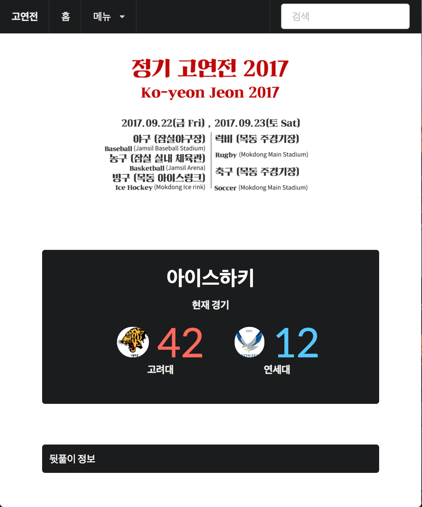
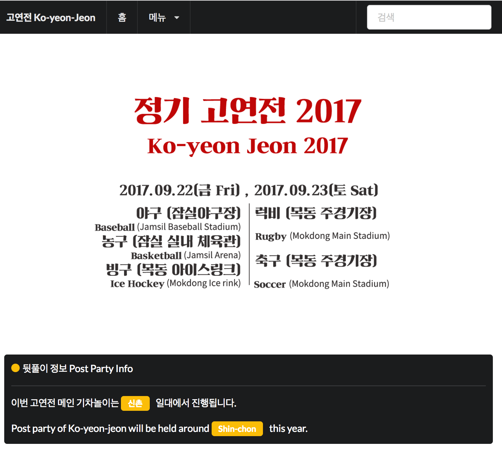
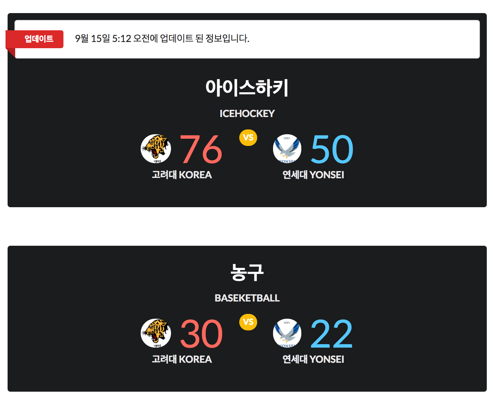
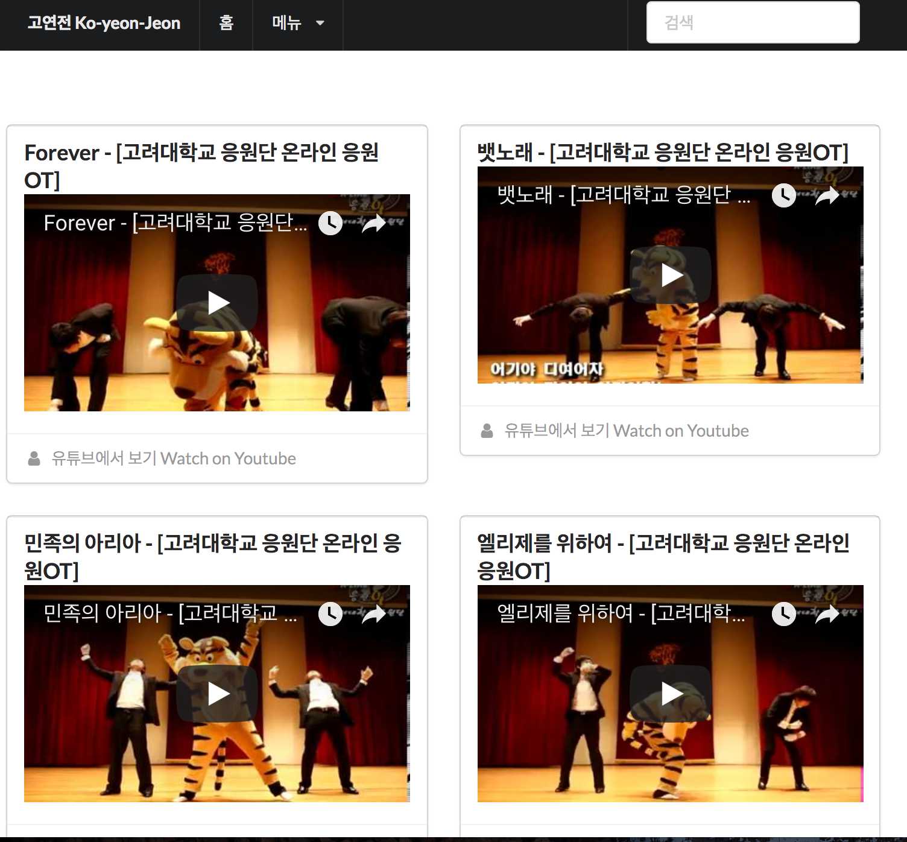
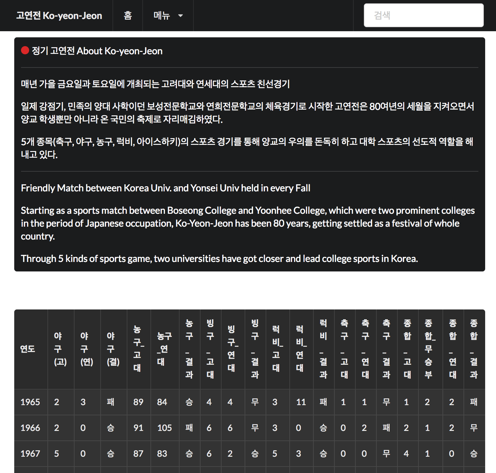

# 2017 가을학기 HCI html 과제 : 고연전 페이지

## 사용법 how to use

`git clone` 혹은 zip 파일을 다운로드하고,
cmd 혹은 terminal (iterm2)를 통해 다운로드한 경로로 이동한다.

그리고 다음 커맨드를 입력한다. (OS X 기준)
```
$ python3 -m venv <가상환경이름>
# 가상환경을 설치한다. Set up virtual environment.

$ source <가상환경이름>/bin/activate
# 가상환경을 활성화한다. Activate virtual environment.

$ pip3 install -r requirements.txt
# 필요한 라이브러리를 설치한다. Install required python libraries.

$ python3 manage.py makemigrations
# migrate에 필요한 정보들을 만든다 # Setup information for migration

$ python3 manage.py migrate
# migrate.

$ python3 manage.py runserver
# 서버를 실행한다. Run Django server.
```

웹 브라우저의 127.0.0.1:8000 에서 확인한다.


## 기술 정보 Tech Info
* Django 1.11.5
* Semantic UI
* Server : Vultr (OS: Ubuntu 16.04 x64 LTS)


## 참고 Reference
[Beomi's Tech Blog](https://beomi.github.io/)

## 스크린샷







